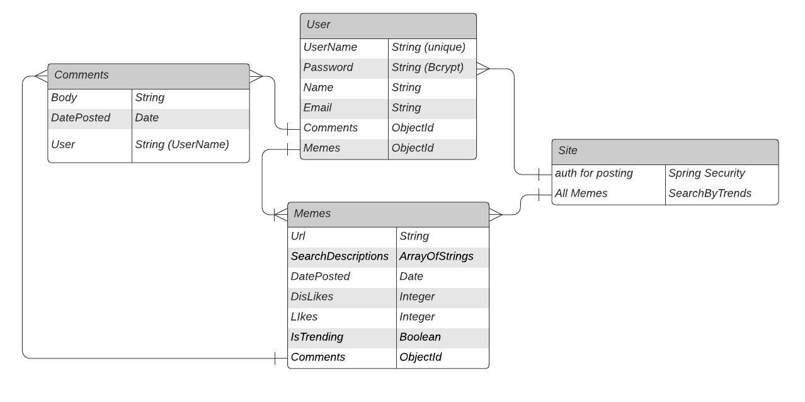

# AllTheMemes.APP
***

## User Story

A browser will be able to browse, seach, comment (as anonymous), and like or dislike on Memes.
User will be able to do all of those and:
* add new Memes to the Database
* have comments tied to their account
* be able to edit tags on their Memes for more search ability
* Delete Memes they have added to the their account

There will be protected and unprotected routes.
***

## Technology

### React.js
I will be using React to form the Front End of this application.
* Styling 
    * Styled Components
    * Bootstrap
    * SCSS
* Axios

### Spring Boot
I will be writing my backend in Java using Spring Boot as my framework.
* Spring Web -- Used in building RESTful applications
* Spring Security -- Used for customizing access control through authentication
* JWT -- JsonWebToken allows for further implementation of Security
* Spring MongoDB -- NoSQL Database additions to allow connection with MongoDB
* Spring Session -- Manages User session and the informaiton in the session

## WireFrame and Database

